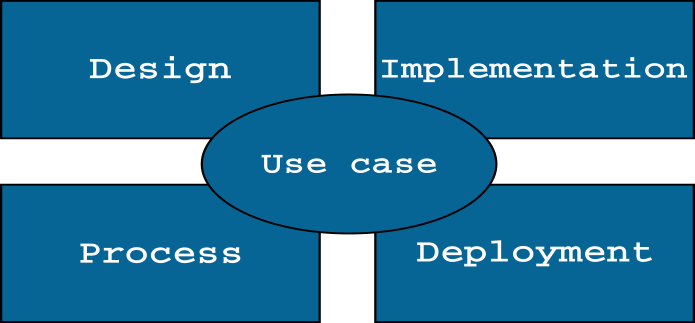

Architecture Overview
=====================

Design View
-----------

Schedulers
++++++++++

.. uml::
  :scale: 50 %
  :align: center

  skinparam monochrome true
  skinparam backgroundColor #d9d9d9

  package alg {
    class ExecutionTime
    class LoadBalancing

    package util {
      class Scheduler {
        + Scheduler(ETC: double[][] , delta: double[][])
        --
        # ETC: double[][]
        # delta: double[][]
      }

      ExecutionTime -up-|> Scheduler
      LoadBalancing -up-|> Scheduler

    }
  }

Genetics
++++++++

.. uml::
  :scale: 50 %
  :align: center

  skinparam monochrome true
  skinparam backgroundColor #d9d9d9

  package alg.util.genetics {
    class ScheduleAllele {
      + ScheduleAllele(numTasks: int, numExecutors: int)
      + ScheduleAllele(numTask: int, numExecutors: int, taskId: int)
      + getTaskId(): int
      + getExecutorId(): int
      + toString(): String
      + equals(object: Object): boolean
      --
      - taskId: int
      - executorId: int
    }

    class ScheduleChromosome {
      + ScheduleChromosome(delta: double[][], numExecutors: int)
      + ScheduleChromosome(delta: double[][], numExecutors: int, genes: ISeq<ScheduleGene>)
      + of(delta: double[][], numExecutors: int): Chromosome<ScheduleGene>
      + toString(): String
      + clone(): ScheduleChromosome
      --
      - numTasks: int
      - numExecutors: int
      - delta: double[][]
    }

    class ScheduleGene {
      + ScheduleGene(numTasks: int, numExecutors: int)
      + ScheduleGene(numTasks: int, numExecutors: int, allele: ScheduleAllele)
      + toString(): String
      + of(numTasks: int, numExecutors: int): ScheduleGene
      + mutate(value: ScheduleAllele)
      + equals(object: Object): boolean
      --
      - numTasks: int
      - numExecutors: int
    }

    class ScheduleMutator {
      + ScheduleMutator(delta: double[][], probMutator: double)
      + mutateChromosome(chromosome: ScheduleChromosome): ScheduleChromosome
      + alter(population: Population<ScheduleGene, Double>, generation: long): int
      - getDependenciesLevels(delta: double[][])
      --
      - numTasks: int
      - probMutator: double
      - levels: ArrayList<ArrayList<Integer>>
    }

    ScheduleChromosome "1"*--"*" ScheduleGene
    ScheduleGene "1"*-down-"1" ScheduleAllele
    ScheduleMutator .up.> ScheduleChromosome

  }

  package org.jenetics {
    interface Gene {
      + getAllele(): ScheduleAllele
      + newInstance(): ScheduleGene
      + newInstance(value: ScheduleAllele): ScheduleGene
      + isValid(): boolean
    }

    interface Chromosome {
      + newInstance(): Chromosome<ScheduleGene>
      + newInstance(genes: ISeq<ScheduleGene>): Chromosome<ScheduleGene>
      + getGene(index: int): ScheduleGene
      + iterator(): Iterator<ScheduleGene>
      + length(): int
      + toSeq(): ISeq<ScheduleGene>
      + isValid(): boolean
    }

  }

  Chromosome <|.. ScheduleChromosome
  Gene <|.. ScheduleGene

Util
++++

.. uml::
  :scale: 50 %
  :align: center

  skinparam monochrome true
  skinparam backgroundColor #d9d9d9

  package alg {
    class ExecutionTime
    class LoadBalancing

    package util {
      class Util {
        + getOnesMatrix(rows: int, int cols: int): double[][]
        + getDeltaMatrix(numTasks: int): double[][]
        + getComcostmatrix(delta: double[][]): double[][]
        + copyMatrix(matrix: double[][]): double[][]
        + getRowSum(matrix: double[][], int row: int): double
        + checkColZero(matrix: double[][], col: int): boolean
        + clearRow(matrix: double[][], row: int)
        + matrixParallelMultiply(matrixA: double[][], matrixB: double[][]): double[][]
        + intMatrixtoDouble(matrix: int[][]): double[][]
      }

    }

    ExecutionTime ..> Util
    LoadBalancing ..> Util

  }

Examples
++++++++

.. uml::
  :scale: 50 %
  :align: center

  skinparam monochrome true
  skinparam backgroundColor #d9d9d9

  package alg {
    class ExecutionTime
    class LoadBalancing

    package util {
      class Util

      package genetics {

      }
    }
  }

  package examples {
    class ExecutionTimeExample
    class LoadBalancingExample

    ExecutionTimeExample ..> ExecutionTime
    ExecutionTimeExample ..> util

    LoadBalancingExample ..> LoadBalancing
    LoadBalancingExample ..> util

  }

Implementation View
-------------------

* Component diagrams

* Sequence diagrams
* Statechart
* Activity diagram

Deployment View
---------------

* Deployment diagrams

* Sequence diagrams
* Statechart
* Activity diagram

Process View
------------

* Threads
* Active classes
* Processes

Use Case View
-------------

.. uml::
  :scale: 50 %
  :align: center

  Actor User
  Actor "Jenetic's Engine"

  rectangle alg.util {

    :User: --> (Create MutationAlterer)
    :User: --> (Create CrossoverAlterer)
    :User: --> (Create Load Balancing Scheduler)
    :User: --> (Run Exmaples)

    :Jenetic's Engine: --> (Mutate Population)
    :Jenetic's Engine: --> (Crossover Population)
    :Jenetic's Engine: --> (Use fitness function)

    (Use fitness function) ..> (Create Load Balancing Scheduler)
    (Create MutationAlterer) <.. (Mutate Population)
    (Create CrossoverAlterer) <.. (Crossover Population)

  }
